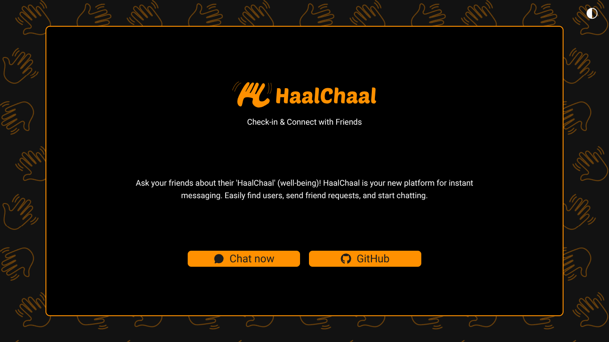
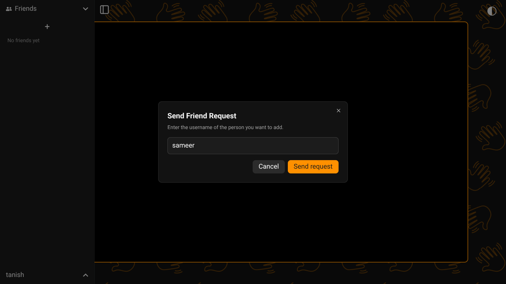
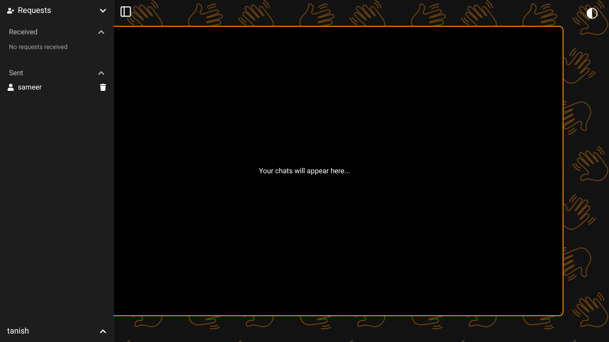
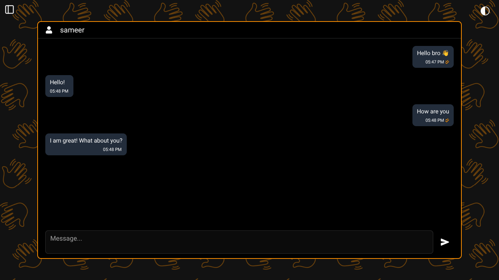

# **HaalChaal** 👋

### **_Check-in & Connect with Friends_**

HaalChaal is a minimal, modern, and fast one-to-one chat application where users can easily discover friends, send requests, and start chatting instantly.  
Ask your friends about their _“HaalChaal”_ (well-being) in real time!

---

## 🌐 **Try it Out**

👉 [Try HaalChaal](https://haalchaal.sameerbhagtani.dev)

---

## 🌟 **Features**

### 👥 Friending System

- Send friend requests to other users
- Accept or reject incoming requests
- Remove friends anytime

### 💬 Chat Experience

- One-to-one instant messaging
- Typing indicator for real-time feedback
- Seen indicator when messages are viewed
- Optimistic UI - messages appear instantly on sender’s screen
- Paginated chat history - older chats load in chunks of 20 while scrolling up

### 🔐 Authentication

- Passwordless login via email (OTP-based)
- Google OAuth login
- Secure JWT authentication flow

### 🎨 UI & UX

- Clean, minimal, and fully responsive design
- Built using **Tailwind CSS** & **shadcn/ui**
- Built-in Dark Mode & Light Mode with seamless theme switching

---

## 📸 Screenshots

---

## 🛠️ **Tech Stack**

### **Frontend**

- Next.js
- TypeScript
- Tailwind CSS
- shadcn/ui

### **Backend**

- Express.js
- TypeScript
- MongoDB (Mongoose)

### **Real-Time**

- Socket.io

---
